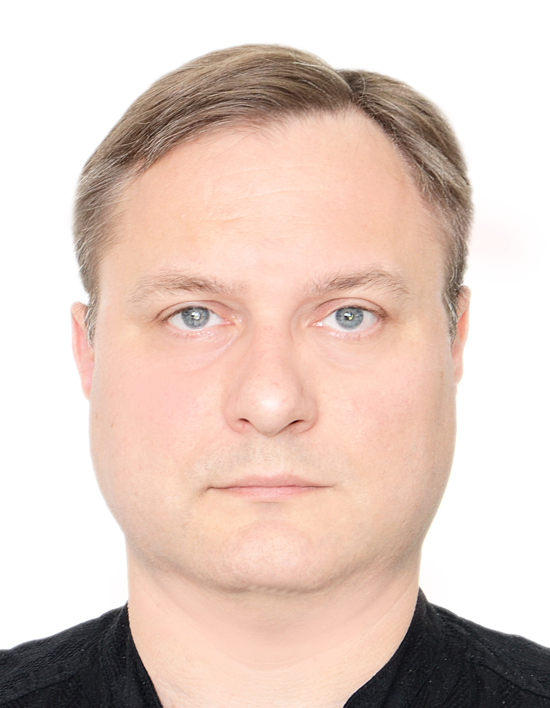

<h1 style="text-align: center;"><b>Привет, меня зовут Павел!</b></h1>

## О себе
Я ученик в [Нетологии](https://netology.ru/). Люблю познавать новое и делиться знаниями с другими.

## Мои навыки
- Программирование на Python
- Работа с Git и GitHub
в будущем:
- Веб-разработка (HTML, CSS, React)

## Контакты
- [Вконтакте](https://vk.com/pahankov)
- [GitHub](https://github.com/pahankov)
